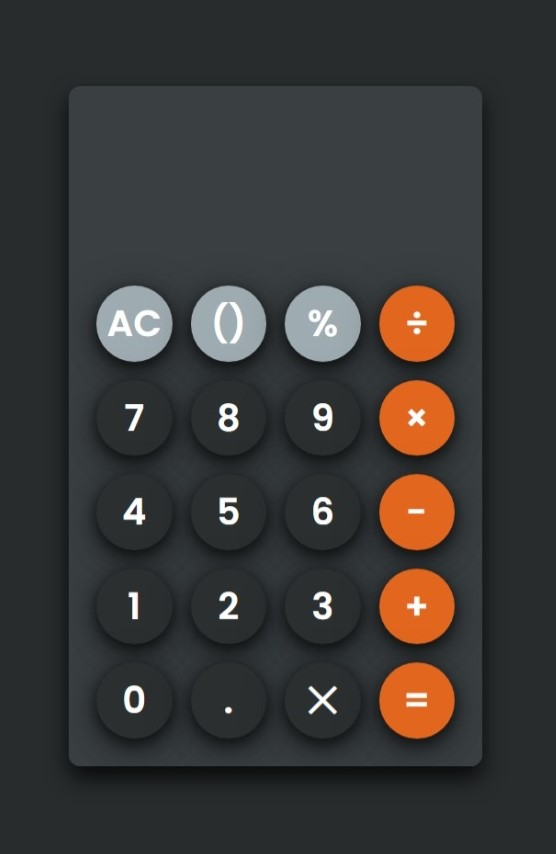

# Calculator

A simple calculator built with **HTML**, **CSS**, and **JavaScript**.

🔗 **[Live Demo](https://saeedasaad.github.io/Calculator/)**

---

## ✨ Features
- Addition, Subtraction, Multiplication, Division
- **Clear (AC)** and **Backspace (DEL)** functions
- **Keyboard support** for digits, operators, Enter (=), and Backspace
- Responsive design (works on desktop & mobile)

---

## 🛠️ Technologies Used
- HTML5  
- CSS3  
- JavaScript (Vanilla JS)  

---

## 🗂️ Project Structure

```text
Calculator/
├── index.html # Main HTML file
├── styles.css # Stylesheet
├── script.js # JavaScript logic
├── images/ # Assets (favicon, etc.)
│ └── favicon.png
└── README.md # Project documentation
```
---

## 📸 Screenshots

|View |
|---------------------------|
|   |

---
## 📌 How to Use
1. Clone the repo  
   ```bash
   git clone https://github.com/saeedasaad/Calculator.git
---
